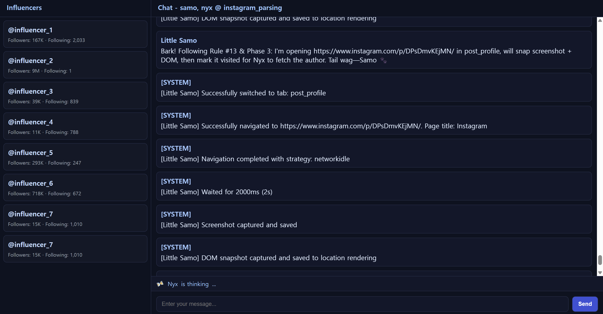

<div align="center">
  
  <h1>SamoAI Instagram Tracker</h1>
  <p><em>AI-powered Instagram influencer discovery tool using <a href="https://github.com/little-samo/SamoAI">@little-samo/samo-ai</a> multi-agent system</em></p>
</div>

<p align="center">
  <a href="#features">Features</a> •
  <a href="#installation">Installation</a> •
  <a href="#usage">Usage</a> •
  <a href="#workflow">Workflow</a> •
  <a href="#learn-more">Learn More</a> •
  <a href="#license">License</a>
</p>

## Features

- **Multi-Agent System**: Two specialized AI agents (Samo & Nyx) working together
- **Dual-Tab Browser Automation**: Efficient Instagram data collection using Chrome tabs
- **Hashtag-Based Discovery**: Find influencers by searching specific hashtags
- **Real-Time Web Interface**: Monitor progress through a modern web dashboard
- **Automated Data Collection**: Extract usernames, follower counts, and profile information
- **Smart Pagination**: Automatically load more posts and continue collection

<div align="center">
  
  <p><em>Web Interface - Real-time monitoring of influencer discovery process</em></p>
  
  
  <p><em>Execution Result - Real-time data collection in progress</em></p>
</div>

## Installation

### Prerequisites

- **Node.js** (version 22.0.0 or higher)
- **Google Chrome** browser installed on your system
- **LLM API Key** (OpenAI, Anthropic, or Google AI)

### Step 1: Clone and Install

```bash
git clone <repository-url>
cd SamoAI-InstagramTracker
npm install
```

### Step 2: Environment Setup

Create a `.env` file in the root directory:

```bash
cp .env.example .env
```

Edit the `.env` file and add your LLM API key (at least one required):

```env
# Choose one or more providers based on your agent configuration
# Check models/agents/ directory to see which LLM your agents are configured to use
OPENAI_API_KEY=your_openai_api_key
ANTHROPIC_API_KEY=your_anthropic_api_key
GOOGLE_AI_API_KEY=your_google_ai_api_key

# Optional: Set custom port for web interface
PORT=5173
```

**📋 API Key Setup Guide:**

1. **Check your agent configuration**: Look at `models/agents/` directory to see which LLM providers your agents (Samo & Nyx) are configured to use
2. **Required API keys**: You need at least one API key that matches your agent configurations
3. **Multiple providers**: You can set multiple API keys if your agents use different LLM providers
4. **Get API keys**:
   - **OpenAI**: [OpenAI API Keys](https://platform.openai.com/api-keys)
   - **Anthropic**: [Anthropic API Keys](https://console.anthropic.com/)
   - **Google AI**: [Google AI Studio](https://aistudio.google.com/app/apikey)

### Step 3: Verify Chrome Installation

The application will automatically detect Chrome on Windows. If you encounter issues, ensure Chrome is installed in one of these locations:
- `C:\Program Files\Google\Chrome\Application\chrome.exe`
- `C:\Program Files (x86)\Google\Chrome\Application\chrome.exe`
- `%USERPROFILE%\AppData\Local\Google\Chrome\Application\chrome.exe`

## Usage

### Quick Start

Launch the Instagram parser with the web interface:

```bash
npm start
```

This will:
1. Start the web server (default: http://localhost:5173)
2. Launch Chrome browser with dual tabs
3. Open the web interface automatically

### ⚠️ Important: Instagram Login Required

**Before starting the data collection process, you must manually log in to Instagram:**

1. **Wait for Chrome to open** with two tabs (`post_list` and `post_profile`)
2. **Log in manually** with your Instagram credentials
3. **Complete any security verifications** (2FA, email verification, etc.)
4. **Return to the web interface** and start chatting with the agents

> **Note**: The agents cannot log in automatically due to Instagram's security measures. Manual login is required for the automation to work properly.

### Web Interface

The web interface provides:
- **Real-time monitoring** of the discovery process
- **Live influencer list** with usernames, follower counts, and bios
- **Progress tracking** of visited posts and profiles
- **Interactive chat** with the AI agents

### Stopping the Application

Close the browser tab and press `Ctrl+C` in the terminal to stop the application.

## Workflow

The Instagram parser follows a sophisticated multi-phase workflow using two specialized AI agents:

### 🤖 Agent Roles

- **Samo**: Navigation specialist
  - Manages browser tabs and navigation
  - Controls the post visiting loop
  - Handles pagination and queue management

- **Nyx**: Content extraction specialist
  - Analyzes page content and extracts data
  - Manages the influencers database
  - Processes profile information

### 📋 Process Flow

#### Phase 1: Setup
1. Switch to `post_list` tab
2. Navigate to hashtag search page (e.g., `#busan_food`)
3. Verify page state with screenshot

#### Phase 2: Collect Posts
1. Extract all post links (`/p/...`) from the hashtag page
2. Build `to_visit` queue with format: `url | unvisited`
3. Track posts to visit and visited status

#### Phase 3: Visit Posts
1. Switch to `post_profile` tab
2. Visit individual post URLs
3. Extract author username from post page
4. Check if author is already in influencers list
5. If new author, visit their profile page
6. Extract follower count, following count, and bio
7. Add to influencers database (avoiding duplicates)

#### Phase 4: Pagination
1. Switch back to `post_list` tab
2. Scroll down twice to load more posts
3. Extract new post links
4. Replace `to_visit` queue with new unvisited posts
5. Continue to Phase 3

#### Phase 5: Progress Tracking
- Monitor current post index
- Track search terms and visited profiles
- Maintain queue status and active tab

### 🔄 Dual-Tab Efficiency

The system uses two Chrome tabs for maximum efficiency:
- **Post List Tab**: Dedicated to hashtag search and post collection
- **Post Profile Tab**: Dedicated to individual post and profile analysis

This eliminates the need to constantly navigate back and forth, significantly improving performance.

## Troubleshooting

### Common Issues

#### Chrome Not Found
```
Error: Chrome executable not found
```
**Solution**: Ensure Google Chrome is installed in one of the standard locations listed in the installation section.

#### API Key Issues
```
Error: No valid API key found
```
**Solution**: Verify your `.env` file contains at least one valid API key.

#### Browser Automation Fails
```
Error: Browser not launched
```
**Solution**: 
1. Check if Chrome is running (close any existing instances)
2. Restart the application
3. Verify Chrome permissions

#### Web Interface Not Loading
```
Error: Cannot connect to localhost:5173
```
**Solution**:
1. Check if port 5173 is available
2. Try different port: `PORT=3000 npm start`
3. Check firewall settings

### Performance Tips

- **Monitor Resource Usage**: The application uses significant memory for browser automation
- **Adjust Scroll Count**: Reduce scroll count in pagination if posts load slowly
- **Limit Collection**: Set reasonable limits for influencer collection to avoid memory issues

### Starting Fresh Search

When you want to start a new hashtag search or reset the collection process:

1. **Stop the application** (Ctrl+C)
2. **Clear state files**:
   ```bash
   # Clear agent state files (keep folders)
   rm states/agents/*.json
   
   # Clear location state files (keep folders)
   rm states/locations/*.json
   
   # On Windows:
   # del states\agents\*.json
   # del states\locations\*.json
   ```
3. **Restart the application**:
   ```bash
   npm start
   ```

This will clear all previous search data and start fresh with a clean state.

## Learn More

- **SamoAI Framework**: [SamoAI Repository](https://github.com/little-samo/SamoAI)
- **Multi-Agent Systems**: Learn about collaborative AI agents
- **Browser Automation**: Puppeteer documentation for advanced customization

## License

[MIT License](LICENSE)

---

<div align="center">
  <p>Made with ❤️ by the SamoAI Team & Youngkwon Ko</p>
  <p><em>Discover influencers, one hashtag at a time</em></p>
</div>